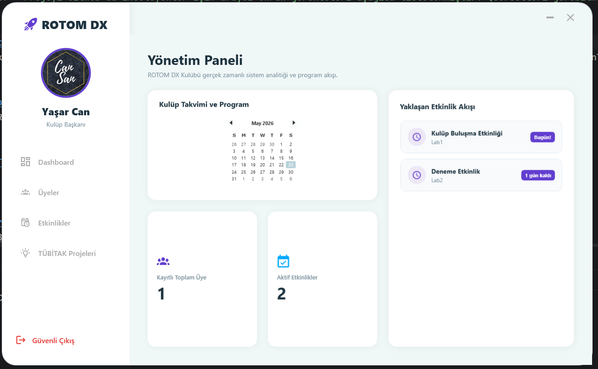
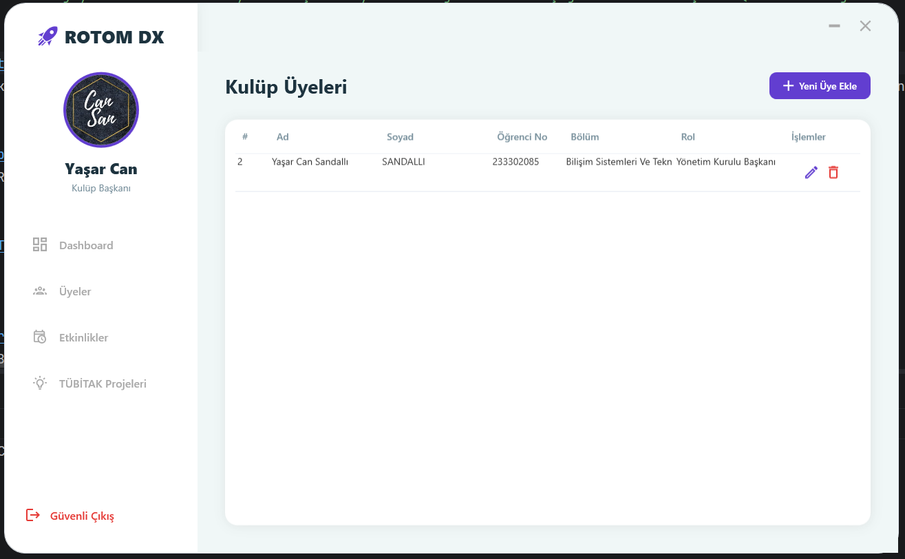
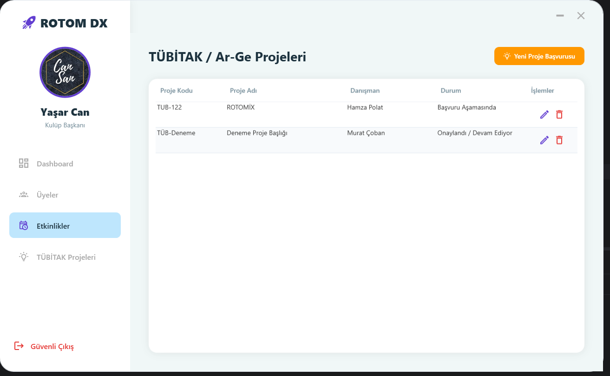

# 🚀 ROTOM DX - Kulüp Yönetim Sistemi

Bu proje, üniversite öğrenci kulüplerinin yönetim süreçlerini dijitalleştirmek, analitik takibini yapmak ve R&D faaliyetlerini tek bir merkezden yönetmek amacıyla geliştirilmiş profesyonel bir masaüstü uygulamasıdır. Proje, **Gelişmiş Nesne Yönelimli Programlama (OOP)** prensiplerine ve **Katmanlı Mimari (Tiered Architecture)** kurallarına tam uyumlu olarak inşa edilmiştir.

## 📸 Uygulama Ekran Görüntüleri (UI/UX)

### 1. Yönetim Paneli (Dashboard)

*Gerçek zamanlı SQL verileriyle beslenen sayaçlar, entegre kulüp takvimi ve otomatik geri sayım yapan yaklaşan etkinlik akışı.*

### 2. Kulüp Üyeleri Yönetim Ekranı

*Tam CRUD operasyonlarını destekleyen, veri tabanından anlık beslenen modern üyeler listesi.*

### 3. TÜBİTAK ve Ar-Ge Projeleri Takip Sekmesi

*Kulüp bünyesindeki bilimsel projelerin danışman hoca ve başvuru durum takip mekanizması.*


---

## 🛠️ Kullanılan Teknolojiler & Kütüphaneler
* **Programlama Dili:** C# (.NET 8.0 Windows)
* **Arayüz Teknolojisi:** WPF (Windows Presentation Foundation) XAML
* **ORM / Veritabanı Altyapısı:** Entity Framework Core (Code-First Yaklaşımı)
* **Veritabanı Yönetimi:** Microsoft SQL Server
* **UI/UX Paketleri:** MahApps.Metro.IconPacks.Material (Vektörel İkon Setleri)

---

## 🏗️ Proje Mimari Yapısı ve Kod Analizi
Proje, kodun sürdürülebilirliği ve okunabilirliği açısından üç ana katmana ayrılmıştır:

### 1. Models (Domain / Nesne Katmanı)
Veritabanındaki tabloların ve OOP nesnelerinin şablonlarını barındırır.
* **BaseEntity.cs:** Tüm tablolarda ortak olan `Id` ve `CreatedDate` alanlarını tutan, doğrudan türetilemeyen **Abstract (Soyut)** temel sınıftır.
* **Person.cs:** `BaseEntity`'den türetilen; `FirstName` ve `LastName` gibi kişisel alanları barındıran soyut bir sınıftır. İçerisinde veri tutarlılığını sağlamak adına **Encapsulation (Kapsülleme)** mekanizması barındırır (`value.Trim().ToUpper()`).
* **ClubMember.cs:** `Person` sınıfından **Inheritance (Kalıtım)** yoluyla türeyen; öğrenci numarası, bölüm ve kulüp rolü gibi spesifik alanları barındıran somut sınıftır.
* **ClubEvent.cs:** Kulüp etkinliklerini haritalandıran sınıftır. İçerisindeki `DaysRemaining` read-only property'si, SQL tablosuna kaydolmadan dinamik zaman hesaplaması yapar.
* **ClubProject.cs:** Kulübün TÜBİTAK ve R&D faaliyetlerini veri tabanına işleyen veri modelidir.

### 2. DataAccess (Veri Erişim Katmanı)
Uygulama ile SQL Server arasındaki köprüyü kurar.
* **ClubDbContext.cs:** Entity Framework Core'un kalbidir. Modelleri `DbSet` aracılığıyla SQL tablolarına dönüştürür ve `OnConfiguring` metoduyla SQL bağlantısını güvenli hale getirir.

### 3. Views (Arayüz ve Mantıksal Denetim Katmanı)
Kullanıcının etkileşime girdiği ekranları ve bu ekranların arkasındaki `Code-Behind` (.cs) mantığını içerir.
* **MainWindow (Ana Pencere):** Uygulamanın kabuğudur. Sol taraftaki aydınlık minimalist navigasyon menüsünü ve RelativeTransform ile tam merkezden ölçeklenen dairesel kullanıcı profil alanını barındırır.
* **DashboardView (Özet Ekranı):** Uygulamanın yaşayan merkezidir. `DateTime.Today` filtreleme algoritması kullanarak geçmiş etkinlikleri eler ve sadece yaklaşan güncel etkinlikleri listeler.
* **Members, Events, Projects Views (Sekme Kontrolleri):** DataGrid bileşenleri üzerinden SQL verilerini UI katmanına dinamik bağlama (Data Binding) ile yansıtır.
* **Modal Windows (Form Pencereleri):** `AddMemberWindow`, `AddEventWindow` ve `AddProjectWindow` formları, **Constructor Overloading (Aşırı Yükleme)** tekniği kullanarak tek bir pencere üzerinden hem sıfırdan ekleme hem de seçili satırı veritabanından bulup doldurarak güncelleme (Update) işlemini gerçekleştirir.

---

## ⚠️ KRİTİK VERİTABANI BAĞLANTI TALİMATI
Bu projede veri güvenliği ve yerel sunucu bağımsızlığı açısından **herhangi bir veritabanı backup (.bak) dosyası repoya dahil edilmemiştir.** Projeyi forklamak veya yerel bilgisayarında çalıştırmak isteyen geliştiricilerin şu adımları izlemesi gerekir:

1. Projenin içerisindeki `DataAccess` klasöründe yer alan **`ClubDbContext.cs`** dosyasını açın.
2. `optionsBuilder.UseSqlServer(...)` satırında bulunan bağlantı adresindeki `Server=YASARCAN;` kısmını, **kendi yerel SQL Server sunucu adınızla** değiştirin:
   ```csharp
   optionsBuilder.UseSqlServer(@"Server=KENDI_SUNUCU_ADINIZ;Database=RotomDxClubDb;Trusted_Connection=True;TrustServerCertificate=True;");